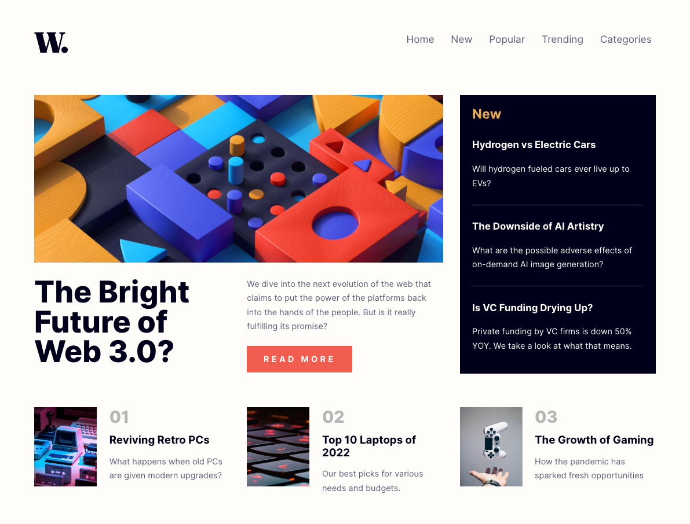

# Frontend Mentor - News homepage solution

This is a solution to the [News homepage challenge on Frontend Mentor](https://www.frontendmentor.io/challenges/news-homepage-H6SWTa1MFl). Frontend Mentor challenges help you improve your coding skills by building realistic projects.

## Overview

### The challenge

Users should be able to:

- View the optimal layout for the interface depending on their device's screen size
- See hover and focus states for all interactive elements on the page

### Screenshot

### Links

- Solution URL: [https://github.com/kevbradwick/frontendmentor-v2/tree/master/challenges/news-homepage](https://github.com/kevbradwick/frontendmentor-v2/tree/master/challenges/news-homepage)
- Live Site URL: [https://frontendmentor-v2-three.vercel.app/news-homepage](https://frontendmentor-v2-three.vercel.app/news-homepage)

## My process

### Built with

- [SvelteKit](https://kit.svelte.dev/)

## Author

- Frontend Mentor - [@kevbradwick](https://www.frontendmentor.io/profile/kevbradwick)
